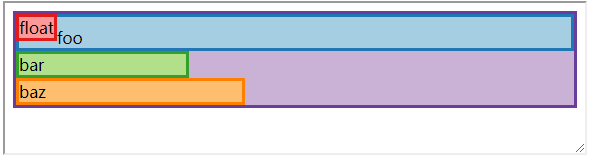

> 从今天开始学习CSS Layout

主要跟着这本书学习[Learn CSS Layout](http://book.mixu.net/css/)

- [1 Box positioning in CSS](#1-box-positioning-in-css)
    - [Positioning Scheme](#positioning-scheme)
    - [Anonymous box generation](#anonymous-box-generation)
    - [Normal flow positioning](#normal-flow-positioning)
        - [block formatting](#block-formatting)
        - [inline formatting](#inline-formatting)
            - [vertical-align属性](#vertical-align%E5%B1%9E%E6%80%A7)
            - [不那么直观的vertical-align:middle](#%E4%B8%8D%E9%82%A3%E4%B9%88%E7%9B%B4%E8%A7%82%E7%9A%84vertical-alignmiddle)
        - [Normal flow: relative positioning](#normal-flow-relative-positioning)
            - [float position scheme](#float-position-scheme)
    - [Absolute / fixed positioning scheme](#absolute--fixed-positioning-scheme)

## 1 Box positioning in CSS

CSS布局的核心就是把HTML的元素映射一些`rectangular boxes`，这些盒子又分布在x、y、z三个轴上，x,y方向上的位置是由`positioning scheme`定义的，在CSS 2.1中定义了三种：`normal flow`，`floats`，`absolute positioning`。

### Positioning Scheme

- `normal flow`：包括三种`fomatting context`，**block, inline, relative**formatting context。
- `floats`：以自己的方式和normal flow进行交互，并形成了大多数现代CSS grid框架。
- `absolute positioning`：作用是相对于normal flow的绝对位置和固定的元素。

涉及这些的CSS的属性是`display`，`position`，`float`。float和absolute定位可以看做是和normal flow的交互，也比较复杂，所以首先了解normal flow。从设计角度layout主要做了两件事：

- 元素盒子的尺寸和对齐是如何处理的，这些一般是通过display的属性(width,height,margin)来完成的
- 有相同父元素的的子元素是如何相互定位的

这章主要讨论第二件事。

标准是这样定义formatting context，即块级元素就在一个block formatting context，行级元素就在inline formatting context。

> Boxes in the normal flow belong to a formatting context, which may be block or inline, but not both simultaneously. Block-level boxes participate in a block formatting context. Inline-level boxes participate in an inline formatting context.

从视觉上看block formatting context就是一个垂直的栈布局，inline formatting context就是一个水平的栈布局。

### Anonymous box generation

当一个父级元素同时包含inline和block元素时，会进行`Anonymous box`的生成，具体规则是：

- 当同时有inline和block元素存在时，会生成`Anonymous block boxes`，并将inline元素放进去。
- 当有inline元素且这个元素被text包裹时，会生成`Anonymous inline boxes`，并将text放进去。

需要注意的是，这些Anonymous box是不会再chrome等浏览器的布局中显示的，参考[这个问题](https://stackoverflow.com/questions/16823693/inline-anonymous-boxes)。

### Normal flow positioning

#### block formatting

block formatting 规则比较简单，如图它遵循这样一些规则

- 每个block box在父盒子的左外边缘
- float不会影响左外边缘的位置，但会影响文字的位置
- 没有设置宽度的block box会填充满整个父盒子的宽度
- 设置了宽度的会从左边开始计算
- 宽度即使没有充满父盒子，block box也不会同一行

#### inline formatting

inline formatting 就比较复杂了，因为它涉及到将内容分割成line box(将那些在一行的boxes的长方形区域称为`line box`)，正常来说inline的元素时在一行中平行布局，当一行放不下时(这里的行宽度由它的父元素决定)会进行垂直布局，此时是以line box为单位垂直布局。

inline box的另一个特点是给它设置`width`、`height`这些属性时会被忽略，通常情况下inline元素的宽度由它的父元素决定。当通过设置`position:absolute`使它成为block时才会使这些属性生效。

对于line box，它的高度可以由`line-height`控制，以绝对高度或者相对高度的形式，绝对高度就是一个固定的值，或者以倍数于当前元素设置的`字体尺寸`来决定，可大可小，默认情况下根据字体的尺寸来决定行高。line box的高度是在计算所有inline box之后进行的，然后设置除过`vertical-align:top/bottom`之外的其它vertical-align属性。[例子](https://codepen.io/aura-zx/pen/zaqyaY)。

当container有width时，[inline的布局](https://codepen.io/aura-zx/pen/eKJXQQ)像是block元素，实际上只是因为width太小，导致每一个inline元素变成了上一段说的line box。

##### vertical-align属性
[直观了解vertical-align在和谁对齐](https://css-tricks.com/what-is-vertical-align/)

垂直居中是一个常见的需求，[这个例子](https://codepen.io/aura-zx/pen/MXyLoa)通过将需要垂直居中的元素设为`display:inline-box`，`vertical-align:middle`解决了水平方向居中的问题，配合一个container后面的样式为`height:100%`的伪元素将line box的高度和container一致，这样该元素就可以和这个伪元素对齐，解决了垂直方向居中的问题。

`display:inline`和`display:inline-box`的区别可以见[这个问题](https://stackoverflow.com/questions/8969381/what-is-the-difference-between-display-inline-and-display-inline-block)。简单说就是inline-box可以设置width和height，但又不会像block一样独占一行。

[这个例子](https://codepen.io/aura-zx/pen/BVKbmK)介绍了当两个元素中间存在空格时会生成一个匿名的inline box导致两个本该在一行的inline box分别在两行。
有几种办法可以解决:

- 手动去掉那个空格，但这样做会影响代码可读性
- 将父盒子的`font-size:0`，再单独给两个子元素设置`font-size`，这可以使那个空格不再占用任何空间
- 父盒子设置`white-space: nowrap`，虽然两个子元素在一行了，但是空格依旧存在
- CSS3的`text-space-collapse`属性，缺点是目前许多浏览器暂不支持

##### 不那么直观的vertical-align:middle

middle的值不像baseline、top、bottom那么直观，由定义它是将盒子(子盒子,一般是inline)的垂直中点和`父盒子的baseline`+`x-height`的一半对齐。

- `父盒子的baseline`:这里的父盒子不是指包含它的container，而是它所在的line box。[这个例子](https://codepen.io/aura-zx/pen/xzOpqv)，可以看到parent是有固定高度60px的，但是"<"却没有那么高
- `x-height`:就是指'x'字符的高度，[这个例子](https://codepen.io/aura-zx/pen/PaGpZN)表明line box的高度也不影响布局。

#### Normal flow: relative positioning

`position:relative`依旧算在文档流中，然后根据`top/left/bottom/right`等属性进行位置的offset。

[这个例子](https://codepen.io/aura-zx/pen/aKmMbJ)可以看出，4个div区域，没有任何样式的情况下是每个div垂直布局的，第一个div增加float之后跳出文档流；第二个div加了10px的padding-top，增加了自己的高度；第三个div将position设置为relative，然后向上移动了20px，向右移动了10px，width成为原来的30%，这里注意，向上移动是通过`-20px`完成的，而向右移动又是通过`10px`完成的，两个方向的正负数值代表的含义并不相同；第四个div只减少了宽度，但是它的位置并没有随着第三个div位置的变化而变化。

##### float position scheme

float布局本意是将文字环绕在图片周围，但现在已经成为CSS里grid布局的基础。

float将块级元素从布局的文档流中取出来，这不会影响那些块级盒子但是会影响line boxes。标准的描述说"float是一个在当前行上向左或向右移动的盒子，最有趣的特性是内容可以沿着一侧流动(flow along its side)。"

float有这些特殊的行为：

- float 跳出文档流，因此它不会影响块级元素的垂直布局
- float 和容器的左或者右外边缘对齐
- float 从左边或者右边堆叠，当有两个right-float元素时，第一个在容器的右外边缘，第二个在第一个的左边
- float 会影响当前和随后的inline元素，所有当前和随后的line boxes都需要缩短以给float留出空间
- float 不在文档流中，所以它通常不会影响父元素的高度，这也是为什么开发"clearfix"技术的原因之一
- float 可以使用clear属性清除

下面逐条解释这些特性：

[caes 1](https://codepen.io/aura-zx/pen/oyPNRL)

浮动的框向左或向右移动，直到它的外边缘接触父容器的的边缘或者另一个浮动框。如果存在line box则浮动框的顶部与当前line box的顶部对齐。以左浮动为例，如果在一个左浮动盒子生成时**已经**有其他的左浮动盒子存在，对每一个生成的左浮动盒子来说要么它的`左边框在已生成的盒子的右边框右边`，要么`top属性小于已生成盒子的bottom`，右浮动同理。

[caes 2](https://codepen.io/aura-zx/pen/gKdbbo)

如果水平空间不够，float会向下移动直到空间足够或者没有更多的float出现。因为float不在文档流中，所以浮动框之前或之后创建的未定位框垂直流动，就像浮动不存在。例子里就是三个div区域正常垂直布局。但是当前和随后的line box就需要缩短宽度为float留出区域，例子中就是绿色和橙色div区域中的文本组成的line box移动了float区域中文本的宽度以便为它留出空间。

[case 3](https://codepen.io/aura-zx/pen/RJYNoj)

float不会影响文档流中用于建立新块级上下文元素内的line box，对应例子中绿色区域的文本组成的line box，这些元素要么放在float的侧面或者任何前面float的下面。

[case 4](https://codepen.io/aura-zx/pen/aKeaLN)

`clear`属性比较好理解，就是去除左边或右边的浮动元素，默认不去除，橙色区域清除了左边的浮动元素，无色区域去除了两边的浮动元素。

[case 5](https://codepen.io/aura-zx/pen/OEKovo)

float的另一个需要关注的特性是父元素高度的计算不考虑浮动元素，也就是说当父容器只有float元素时，它的高度为0。原因是在计算块级元素高度时需要考虑一个属性`overflow`，它的默认值为`visible`，这种情况下不考虑float元素，当你将他设置为其它值时就会将那些float元素计算在内了。

[case 6](https://codepen.io/aura-zx/pen/JZgaaW)

`claerfix`技术是对基本浮动清除的增强，case 6想把将三组float元素塞进他们对应的父容器中，以目前的知识有三种做法：

- 在父元素的两个float元素之后增加一个`clear:both`的元素，也就是例子中的.hide。
- 在父元素后增加一个具有`clear:both`的伪元素，也就是例子中的.clearfix:after。
- 改变父元素的`overflow`属性的值

这三个方法一般使用后两个方法，这其中又比较推荐伪元素方法，[这个例子](https://codepen.io/aura-zx/pen/XYvPwj)体现了伪元素方法的优势，如果是修改`overflow`属性值，会将溢出内容可滚动而不是可见。

### Absolute / fixed positioning scheme

Absolute / fixed 定位是比较简单直观的一种模式，boxes相对于它的父容器以绝对偏移量定位。文档流计算定位的时候会忽略绝对定位，同时绝对定位也不与它的兄弟元素交互，绝对定位元素中的float元素只与绝对定位元素中的其它元素交互。这两种定位模式都与`width`，`height`，`top`，`left`，`bottom`，`right`属性有关系，如果这些属性都明确定义了，计算结果是非常直观的，但只是部分指定，计算过程就复杂很多。

- fix定位与viewport有关
- absolute定位与父元素有关

