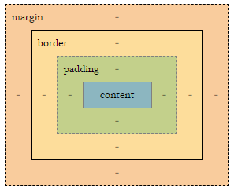
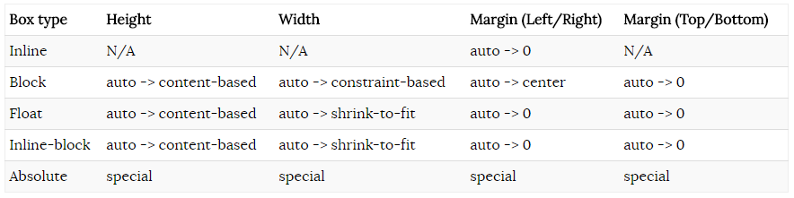

## Box sizing in CSS

CSS box的计算依赖于box model，每一个box都有一个content区域以及`可选`的围绕着content区域的padding，border和margin三个部分，如图所示。

### Content dimensions and margins

[case 1](https://codepen.io/aura-zx/pen/QBLaoP)

`padding`和`border`的属性渲染结果一贯比较稳定，都是围绕着content区域。唯一主要的corner case是在inline的元素上（不包括inline-block），左边和右边的border只渲染一次，即使content太多折行了，上下的border会在多行都渲染，但是和block元素渲染的方式不太一致。

例子中的第一段border在block元素中，所以它渲染成一个单独、连续的box。

第二段border在inline元素中，如上面所说，它的左右border只渲染了一次，第二行上面的border在第一行下面border之上。

另外两个盒模型有趣的方面是`content dimension的计算`和`margin:auto对不同类型元素的影响`。content dimension也就是`height`和`width`的计算。
 
 如图总结了content dimension 和 margin:auto的机制。

### Box model calculations for inline elements

`inline, non-replaced元素`：`width`和`height`属性忽略，不参与计算，实际的宽和高完全由他们的内容决定。inline元素在布局中是放在line box中进行计算的，line box的尺寸基于`font-size`和`line-height`计算。`margin-top`和`margin-bottom`属性同样是忽略不计算的，但是`margin-left`和`margin-right`能正常使用，相对同一个line box中的其它元素布局。

### "Content-based" height for blocks, floats and inline-blocks

blocks, floats, inline-blocks在属性`height:auto`的情况下有相同的计算方式。`height:auto`意思是元素的高度以content决定，有两种基于content的高度计算方法：

- 一种是floats, inline-block和block元素在文档流中并且没有将`overflow`设置为visible的计算方法
- 另一种是block元素在文档流中并且`overflow:visible`的计算方法

两种计算方式将content作为高度的计算依据，但是对于`overflow:visible`的block元素，会忽略子元素中的float元素，这就是为什么当只有float子元素时，父元素的高度为0的原因。

当`overflow`的值不是visible时，float元素的高度会计算进去，标准里说

>  if the element has any floating descendants whose bottom margin edge is below the element's bottom content edge, then the height is increased to include those edges. Only floats that participate in this block formatting context are taken into account, e.g., floats inside absolutely positioned descendants or other floats are not.

也就是说，当`width`和`height`为auto时，blocks会一直扩展，直到完全包裹content，但对于float元素，仅是那些参与block formatting context的参与计算，比如absolute定位的元素就不参与。

### Width calculation

宽度的计算要更复杂些，针对`width`和`margin`值都为auto的情况有两种算法。

Block-level元素使用`constraint-based`的方法，所谓的限制也就是盒模型（比如`border`，`padding`，`margin`等属性），如果`width`或者`margin`其中有一个的值设置为auto，则这个auto的计算是通过可使用的空间减去那些已经设定好有具体值的属性得到的值作为auto最终渲染时使用的结果。

Floating block和inline-block元素使用`shrink-to-fit`的方法，它包括三个步骤，1)首选宽度（例如，尽可能少的换行符），2)首选最小可用宽度（例如，使用尽可能多的换行符），3)可用的宽度。

如果水平空间可用，则宽度值设置为`首选宽度`，否则设置为`首选最小宽度`，最坏的情况下，可用宽度可能存在一些潜在的溢出。对于floating block和inline-block元素，`margin:auto`会被解读为`margin:0`。

#### Width calculations: block-level elements(constraint-based)

#### Width calculations: floating blocks and inline-block elements(shrink-to-fit)