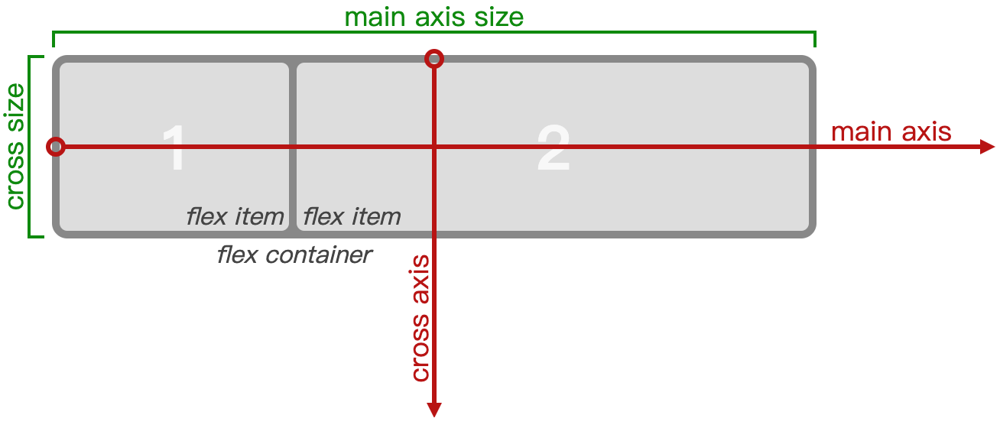
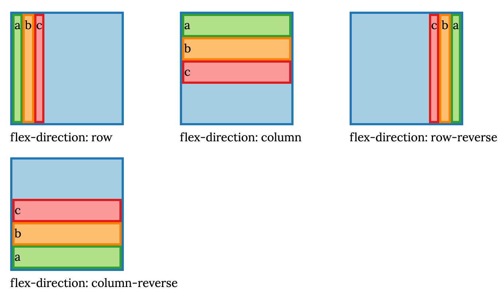
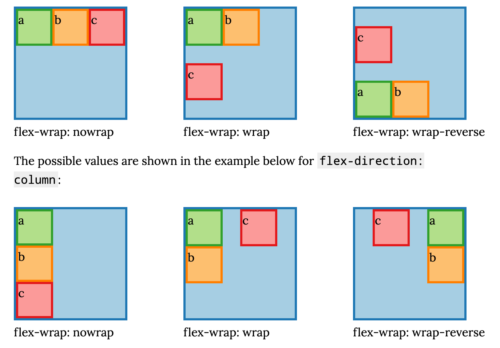
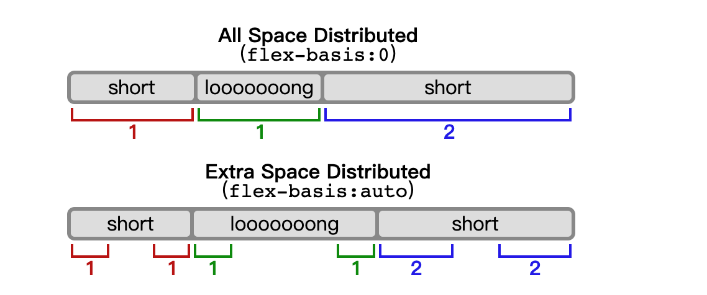
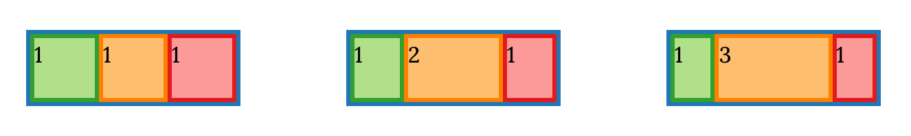
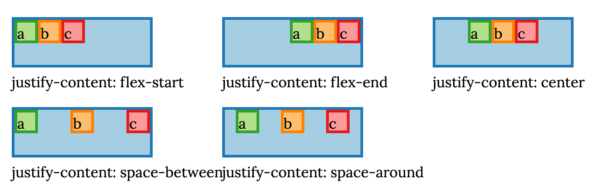
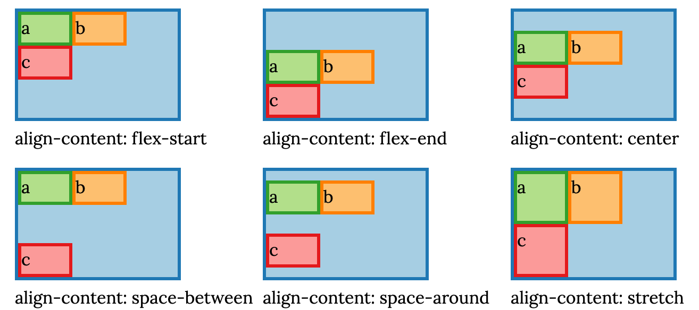
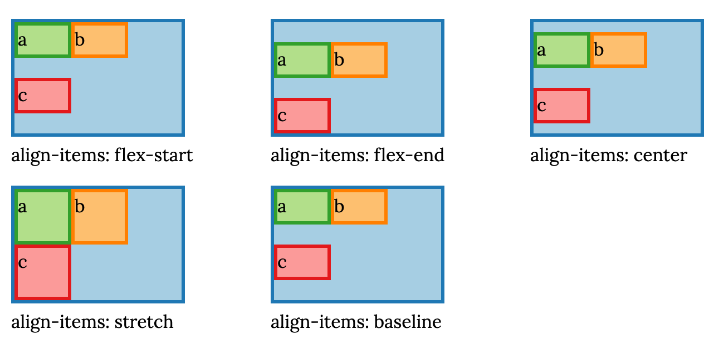

本章主要讨论 CSS 3 中加入的`flexbox`布局。

新的`display:flex`布局模式是作为 CSS 2.1 中的布局的替代品出现的。它在现代浏览器中有着广泛的支持，这意味着它可以在 IE 10 以上的版本中使用。

CSS 布局一个一贯存在的问题是，控制负空间(实际内容之间的空间)的分配方式有困难。在许多情况下，你无法强制用户使用特定的视口/显示大小，也无法完全控制需要在Web应用程序的特定部分中显示多少子项。

CSS 3的`flexbox`布局是解决管理负空间的一个方案。它提供了很多一个`flexbox`的父元素中子元素如何控制大小，包装和对齐。

`flexbox`的基本假设是，作为控制者，你希望`flexbox`的中的内容能在下面两种情况中进行很好的控制：

- 当父级元素可用宽度和高度有变化的情况
- 容器中子项数有变化的情况

`flex`在`flexbox`中指的是当可用宽度或高度大于或小于子框所需的'理想'量时，指定如何调整子项大小的能力。

## 1 Flexbox Properties

`flexbox`属性可以分为两部分：设置在`父元素`上的属性和设置在`子元素`上的属性。

- `flex容器`的属性
  - `display:flex`和`display:inline-flex`
  - `flex-flow`(缩写)
    - `flex-direction`：子元素堆叠的方向
    - `flex-warp`：flex项能否包裹其他flex行
  - `justify-content`：元素在主轴(main axis)上如何定位
  - `align-items`：元素在副轴(cross axis)如何相对它们的 flex lines 定位
  - `align-content`：flex lines 是如何相对副轴上的父元素定位

从这些属性上可以看出，`flexbox`的父元素在某种程度上类似常规段落的文本(例如内联级格式化上下文)，但不像正常的段落或者一个列表行，`flexbox`的父元素可以决定子元素的堆叠方向为水平(`flex-direction:row`)或者垂直(`flex-direction:column`)。

- `flex项`的属性
  - `order`：元素的顺序
  - `flex`(缩写)
    - `flex-grow`：当主轴上留有空间时，分配给子元素的空间比例
    - `flex-shrink`：当主轴上没有足够的空间时，分配给子元素的负空间(收缩)的比例
    - `flex-basis`：子项的内容维度如何影响`flex-grow`和`flex-shrink`的计算
  - `align-self`：子元素用来复写父元素`align-items`属性

如果只有一个属性值得注意的话，那就是`flex-basis`，它是决定 flex resizing 和 flex 项如何放置在 flex lines 上的关键。

### display:flex and anonymous box generation

首先，如何触发`flexbox`布局以及它适用于哪些元素？

`flexbox`布局影响每一个父元素下面所有的直接子元素。要触发`flexbox`布局，将父元素设置为`display:flex`。该父项的每个子元素都将使用`flexbox`布局。

> ​	与块级格式化上下文和内联格式化上下文的工作方式类似，flex容器的每个子元素都变为flex项；如果有必要，对于没有包含元素的文本内容匿名盒，每一个in-flow子项都变为flex项，并且直接包含在flex容器内的每个连续文本行都包含在匿名flex项中。但是，不会渲染仅包含空格的匿名flex项(例如，可能受空白属性影响的字符)，就好像它是`display:none`。[source](https://www.w3.org/TR/css-flexbox-1/#flex-items)

但是，absolute定位的子项被排除在外。

> ​	flex容器中的absolute定位的子项不会在flex布局中。但是它却会被`order`属性影响，影响到它被渲染的顺序。[source](https://www.w3.org/TR/css-flexbox-1/#abspos-items)

一个in-flow子项变成flex项意味着什么？

> flex项的`display`值会被阻塞：如果生成flex容器的元素的in-flow子节点的`display`值是内联级别的值，则计算块级别的等效值。
>
> 一些`display`值会触发生成一个围绕原盒子的匿名盒。它是最外层的盒子-flex容器的直接子盒，会成为一个flex项。例如两个相邻的`display:table-cell`子元素，包裹它们的匿名table盒子会成为一个flex项。

总结一下，所有的`display:inline-*`的子元素都会被当做`display:block`，例如，`display:inline-table`会变成`display:table`；flex项的尺寸取决于它基于的最外层盒子。

### Flex container properties: main and cross axis

Flexbox 父项可以决定子项是水平或者垂直布局。你可以按照自己需要切换它们的方向，flexbox的标准使用了`main axis`和`cross axis`来命名，子项堆叠的方向称为主轴，垂直于主轴的轴称为横轴



`flex-direction`属性控制着主轴的方向。默认值是`flex-direction:column`，其它可能的值如下图所示



### Flex container properties: flex lines

就像内联格式化上下文一样，flex容器的内容可以布局在很多行上。

> Flex items in a flex container are laid out and aligned within *flex lines*, hypothetical containers used for grouping and alignment by the layout algorithm.

`flex-wrap`属性控制着子元素是否包裹或者溢出。

> A flex container can be either single-line or multi-line, depending on the flex-wrap property:
>
> - A *single-line* flex container lays out all of its children in a single line, even if that would cause its contents to overflow.
> - A *multi-line* flex container breaks its flex items across multiple lines, similar to how text is broken onto a new line when it gets too wide to fit on the existing line. When additional lines are created, they are stacked in the flex container along the cross axis according to the flex-wrap property. Every line contains at least one flex item, unless the flex container itself is completely empty. [source](http://www.w3.org/TR/2015/WD-css-flexbox-1-20150514/#flex-lines)



### Flex items: flex item sizing

为了理解 flex 项如何在 flex lines 上分布的，需要先知道他们的尺寸是如何计算的。[flex标准中Section 9](https://www.w3.org/TR/css-flexbox-1/#layout-algorithm) 描述

了布局算法的细节，但就我们的目的而言，有趣的是要注意定位按照下面的顺序执行：

1. 使用`flex-basis`计算容器的大小和每个flex项的初始大小
2. 将 flex 项分配给 flex lines，(如果有`flex-warp`属性)
3. 每个 flex 项的最终大小由`flex-grow` 和`flex-shrink`计算得出
4. flex lines 在主轴上对齐(`justify-content`)
5. flex lines 在副轴上对齐(`align-items`,`align-content`和`align-self` )

换句话说，这个顺序中有三个高级步骤：

- `将项分配到flex lines`：计算 flex 项的初始大小，并根据这个大小在 flex lines 上划分项
- `在每个flex line上面重新计算flex项的尺寸`：在每条line上计算每个item的最终大小
- `对齐lines和items`：先是lines的对齐，然后是items的对齐

### flex-basis

`flex-basis`是理解 flexbox 布局是如何计算的关键属性，因为它会影响 flex 项如何分割到其它线上以及之后发生的 flex 计算。

`flex-basis`属性作用在 flex 项上(它也可以继承自父元素)

合法的值：

> - *auto*: When specified on a flex item, the auto keyword retrieves the value of the main size property as the used flex-basis. If that value is also auto, then the used value is content.
> - *content*: Indicates automatic sizing, based on the flex item’s content.
> - *width*: For all other values, flex-basis is resolved the same way as width in horizontal writing modes: percentage values of flex-basis are resolved against the flex item’s containing block, i.e. its flex container, and if that containing block’s size is indefinite, the result is the same as a main size of auto. Similarly, flex-basis determines the size of the content box, unless otherwise specified such as by box-sizing. [source](http://www.w3.org/TR/2015/WD-css-flexbox-1-20150514/#flex-basis-property)

正如标准里描述的，`flex-basis`属性控制弹性项目的初始主要大小，这一过程是在根据弹性因子分配自由空间之前的。

> specifies the flex basis: the initial main size of the flex item, before free space is distributed according to the flex factors. [source](http://www.w3.org/TR/2015/WD-css-flexbox-1-20150514/#flex-basis)

本质上，`flex-basis`如果有具体的值，那么在 flex 相关的计算中作用是替代`width`或`height`的角色，所谓具体的值就是px或者百分比(相对于父元素)。

如果`flex-basis`的值被设置为`auto`或者`content`后，则与 flex 相关的计算可以通过并使用在元素本身上设置的值，或通过基于内容的计算得出。标准提供了以下说明：



但我认为从四种不同的弹性尺寸操作模式(我提出的术语，并不是标准术语)方面更容易理解`flex-basis`。

`purely proportional`：纯比例运算模式，设置`flex-basis:0`相当于将子元素的默认`width`或者`height`为`0px`，换句话说：

- flex 项目内容的实际宽度对元素计算的最终大小没有任何影响
- flex 项永远不会换行，因为关于何时换行到新行的决定是基于子项的 flex 基本大小完成的，并且显式设置的[确定值](https://www.w3.org/TR/css-flexbox-1/#definite)优先于 flexbox 算法

`fixed basis + proportional`：固定基数+比例运算模式，设置`flex-basis: Npx`，`N`会导致在计算元素大小时将这些元素视为具有`N`个像素的 flex 的基本大小。

- 当 flex 项的 flex base值的总和大于 flex 容器可用的主轴幅度，则会发生换行
- 当计算`flex-grow`和`flex-shrink`时，将比例增长或收缩与`Npx`的基础尺寸相加或相减

`auto basis + proportional`：自动基础 + 比例运算模式，设置`flex-basis:auto`，`flex-basis`的真实值回落到元素的`width`或`height`上，如果他们没有被指定，则回落到通常用于计算`width`和`height`的算法上。

- 当做出需要换行的决定时，flex 项目是需要有确定的`width`和`height`的，如果没有，则大小基于内容
- 当计算`flex-grow`或`flex-shrink`时，将比例增长或收缩与基础宽/高或者计算后的宽/高相加或相减

`content basis + proportional`：内容基础 + 比例运算模式，设置`flex-basis:content`，计算 flex 项目的基础大小就好像底层元素具有`width:auto`和`height:auto`。

- 关于换行和`flex-grow`、`flex-shrink`的决定都是在设置`width:auto`和`height:auto`计算的值上运行的
- 目前`flex-basis:content`非常新，在Chrome和Firefox都不支持

现在已经了解了`flex-basis`属性是什么以及如何影响 flexbox 的计算，接下来看一下 flex 项目是如何分割到 flex lines 上的。

### Dividing flex items onto flex lines

flex 项被分割到不同的 flex line 上是基于`hypothetical main size`，在标准的[9.3节](http://www.w3.org/TR/css3-flexbox/#main-sizing)有具体的描述，将 flex 项目分割到 flex lines 上的过程非常简单：

> Collect flex items into flex lines:
>
> - If the flex container is single-line, collect all the flex items into a single flex line.
> - Otherwise, starting from the first uncollected item, collect consecutive items one by one until the first time that the next collected item would not fit into the flex container’s inner main size (or until a forced break is encountered, see §10 Fragmenting Flex Layout). If the very first uncollected item wouldn’t fit, collect just it into the line.
>
> For this step, the size of a flex item is its outer hypothetical main size.
>
> Repeat until all flex items have been collected into flex lines.

这里面唯一 tricky 的地方是如何理解`outer hypothetical main size`。

[标准9.3](http://www.w3.org/TR/css3-flexbox/#algo-main-item)中描述了这一过程的细节，简单地说，如果`flex-basis`被设置了确定的值(比如具体的像素值)，这就是 flex 的基本大小，通常这是盒子在主轴上可以采用的适应其内容的最小尺寸。

`hypothetical main size`的计算是通过将`min-width`,`min-height`,`max-width`,`max-height`用作约束于 flex basis 得出的值。

> The hypothetical main size is the item’s flex base size clamped according to its min and max main size properties.

那一节的细节还是比较纷繁复杂的，有一个简单的方法可以去看这个值在实际是怎么实现的：设置`flex-grow`和`flex-shrink`为`0`去禁止`resizing`行为和设置`width/height`为`0`。这可以让你直观地看到每一个子元素的主轴尺寸的计算。由于换行发生在任何增长或收缩之前，因此在启用增长或收缩后，换行的断点相同。

请注意，自从最初撰写本章以来，规范发生了变化，最初的版本中，内在大小的规则是：

> The main-size min-content/max-content contribution of a flex item is its outer hypothetical main size when sized under a min-content/max-content constraint (respectively)

但是2015年之后：

> The main-size min-content/max-content contribution of a flex item is its outer min-content/max-content size, clamped by its flex base size as a maximum (if it is not growable) and/or as a minimum (if it is not shrinkable), and then further clamped by its min/max main size properties.

现在，代替了`hypothetical outer main size`， 在`flex-grow:0`/`flex-shrink:0` 的条件下，flex 项的值是`min(max(content-size, flex-basis), max-width/max-height)` / `max(min(content-size, flex-basis), min-content-size)`。

下面的例子展示出了四种不同的操作，从左至右分别是：

- `flex-basis: 0` with `width: 45px` on each flex item results in the items having at least a `0px` width, or their content size if it is greater.
- `flex-basis: 10px` with `width: 45px` on each flex item results in the items having at least a `10px` width, or their content size if it is greater.
- `flex-basis: 35px` with `width: 45px` on each flex item results in the items having at least a `35px` width, or their content size if it is greater.
- `flex-basis: 35px` with `width: 45px` and `max-width: 10px` on each flex item results in the items having a `10px` width.
- `flex-basis: auto` with `width: 45px` on each flex item results in the items having a `45px` width, and the items wrap because the sum of flex basis sizes exceeds the flex container's width.
- `flex-basis: content` with `width: 45px` on each flex item should result in the flex items being sized exactly to their content, but this value is not supported as of the time I'm writing this.


```html
<div class="flex-parent blue">
  <div class="green">aaa</div><div class="orange">bbbb</div><div class="red">ccc</div>
</div>
```

```css
.flex-parent {
  display: flex;
  flex-direction: row;
  flex-wrap: wrap;
  flex-grow: 0;
  justify-content: flex-start;
  width: 150px;
  height: 100px;
}
```

现在，我们已经看到项目是如何放置在 flex lines 上的，接下来我们看一下`flex-grow`和`flex-shrink`属性以及相关的计算工作。

### Resizing the flex items on each flex line

`flex-grow`和`flex-shrink`控制了 flex 项是如何 resize 的，它们都接受一个无单位的非负数字，设置它们为`0`会导致禁止 flex 项目增加到它的 flex line 的大小，或者在 flex 项溢出 flex 容器时缩小它们。

`flex-grow`的默认值是`0`，`flex-shrink`的默认值是`1`。当 flex line 的主轴尺寸大于其 flex 项总主轴尺寸时，应用`flex-grow`属性，当 flex line 的主轴尺寸小于其 flex 项总主轴尺寸时，应用`flex-shrink`属性。

许多 flexbox 的指南有类似这样的描述：

> If all items have flex-grow set to 1, every child will set to an equal size inside the container. If you were to give one of the children a value of 2, that child would take up twice as much space as the others.

某种程度上是对的，至少在简单的例子里。比如，在下面的图中，标为`1`的 divs 拥有属性`flex-grow:1`，标为`2`的 divs 拥有属性`flex-grow:2`，它们表现得就像上面描述的一样。



但是，正如我们之前关于`flex-basis`的讨论，这并不是整个的图景，因为`flex-basis`也参与了计算，而且，用于计算最终主轴尺寸的精确算法实际上在`flex-grow`和`flex-shrink`之间是不同的，最后`min-*`和`max-*`的约束也会影响这些计算。

flexbox 的[标准9.7](http://www.w3.org/TR/css3-flexbox/#resolve-flexible-lengths)中详细描述了算法，但我在这里不会复制文本，因为由于许多复杂的因素都在都在规范的算法中处理，所以难以完全遵循它。

使算法复杂化的主要因素是：

- Inflexible 的项目，有着属性`flex-basis:0`和`flex-basis:Npx`的项目会立即占据空间；只有在应用这些项目后留下的空间才会被考虑用于 flex 项的尺寸调整。
- max 和 min 的限制也参与到算法中。该规范的描述中花费了相当多的步骤来处理 flexbox 大小调整不应违反任何设置在 flex 项中的`min-width`和`min-height`的限制。这让我们知道了这些值是非常直观的，但是这些细节却不必要的复杂化了算法的解释。
- `flex-grow`和`flex-shrink`完全不同的计算方法：空闲空间如何被分配的计算对于它们俩是不同的，这是我们接下来要注意的点。

flex 大小调整循环的本质包括[三个步骤](http://www.w3.org/TR/css3-flexbox/#resolve-flexible-lengths)：

> - Check for flexible items. If all the flex items on the line are frozen, free space has been distributed; exit this loop.
> - Calculate the remaining free space as for initial free space, above. If the sum of the unfrozen flex items’ flex factors is less than one, multiply the initial free space by this sum. If the magnitude of this value is less than the magnitude of the remaining free space, use this as the remaining free space.
> - Distribute free space proportional to the flex factors.

最后一部分是`flex-grow`和`flex-shrink`的不同。

### Calculations for flex-grow

当使用 flex grow factor 时，自由空间分布的方法如下：

> - Find the ratio of the item’s flex grow factor to the sum of the flex grow factors of all unfrozen items on the line.
> - Set the item’s target main size to its flex base size plus a fraction of the remaining free space proportional to the ratio.

让我们计算一个具体的例子，假设：

- the flex parent container is `flex-direction: row` and has a width of `100px`
- that there are two flex items:
  - Item #1:
    - has a flex base size of `10px` (e.g. `flex-basis: 10px`or `flex-basis: auto` plus `width: 10px`)
    - has a `flex-grow` factor of `1`
  - Item #2:
    - has a flex base size of `20px`
    - has a `flex-grow` factor of `2`

跟着算法：

- First, calculate the remaining free space. In this case, it is `100px` - `10px` - `20px` = `70px`
- Find the ratios of the flex grow factor to the sum of the flex grow factors for each item. The ratios are:
  - Item #1: `1/3`
  - Item #2: `2/3`
- Set the item’s target main size to its flex base size plus a fraction of the remaining free space proportional to the ratio.
  - New size for item #1: `10px + 1/3 * 70px = 33.3333px`
  - New size for item #2: `20px + 2/3 * 70px = 66.6666px`

这个代码例子可以检验我们的计算

```css
.flex-parent {
  display: flex;
  flex-direction: row;
  flex-wrap: nowrap;
  flex-basis: auto;
  width: 100px;
  height: 50px;
}
.one {
  flex-grow: 1;
  width: 10px;
  border: none; /* simplify calculations */
}
.two {
  flex-grow: 2;
  width: 20px;
  border: none;
}
```

```html
<div class="flex-parent blue">
  <div class="one green">1</div><div class="two orange">2</div></div>
</div>
```

### Calculations for flex-shrink

当使用 flex shrink factor 时，自由空间分布方法如下：

> - For every unfrozen item on the line, multiply its flex shrink factor by its inner flex base size, and note this as its scaled flex shrink factor.
> - Find the ratio of the item’s scaled flex shrink factor to the sum of the scaled flex shrink factors of all unfrozen items on the line.
> - Set the item’s target main size to its flex base size minus a fraction of the absolute value of the remaining free space proportional to the ratio.

同样，让我们计算一个具体的例子，假设：

- the flex parent container is `flex-direction: row` and has a width of `100px`
- that there are two flex items:
  - Item #1:
    - has a flex base size of `100px`
    - has a `flex-shrink` factor of `1`
  - Item #2:
    - has a flex base size of `100px`
    - has a `flex-shrink` factor of `2`

跟着算法：

- First, calculate the remaining free space. In this case, it is `100px` - `100px` - `100px` = `-100px`
- Calculate the scaled flex shrink factor, which is the flex base size multiplied by the flex shrink factor:
  - Item #1: `1 * 100px = 100px`
  - Item #2: `2 * 100px = 200px`
- Calculate the ratio of the scaled shrink factor to the sum of scaled shrink factors:
  - Item #1: `100 / 300 = 1/3`
  - Item #2: `200 / 300 = 2/3`
- Set the item’s target main size to its flex base size minus a fraction of the absolute value of the remaining free space proportional to the ratio.
  - New size for item #1: `100px - 1/3 * 100px = 66.666px`
  - New size for item #2: `100px - 2/3 * 100px = 33.333px`

这个代码例子可以检验我们的计算

```css
.flex-parent {
  display: flex;
  flex-direction: row;
  flex-wrap: nowrap;
  width: 100px;
  height: 50px;
}
.one {
  flex-shrink: 1;
  width: 100px;
  border: none; /* simplify calculations */
}
.two {
  flex-shrink: 2;
  width: 100px;
  border: none;
}
```

```html
<div class="flex-parent blue">
  <div class="one green">1</div><div class="two orange">2</div></div>
</div>
```

为什么`flex-shrink`这样计算，而不使用更简单的`flex-grow`的计算方法， [标准7.1](http://www.w3.org/TR/2015/WD-css-flexbox-1-20150514/#flex-property)中的一个笔记这样解释：

> Note: The flex shrink factor is multiplied by the flex base size when distributing negative space. This distributes negative space in proportion to how much the item is able to shrink, so that e.g. a small item won’t shrink to zero before a larger item has been noticeably reduced.

像这样分配负空间会将更多的收缩分配给具有更大 flex basis 的项目，从而使较小的项目不会缩小到0。

### Flex line alignment and flex item alignment

最后，flex line 和 flex item 有很多种方法可以对齐，相较于 flex 项目的尺寸计算，对齐是一个非常简单的过程：

如果在调整项目大小后有剩余空间，则根据相关属性进行分配。

对于项目的对齐，每一个 flex line 是独立布局的。

> Once content is broken into lines, each line is laid out independently; flexible lengths and the justify-content and align-self properties only consider the items on a single line at a time.

### Main axis alignment: justify-content

flex 项目在每一条线上的对齐是由`justify-content`属性控制：

> The `justify-content` property aligns flex items along the main axis of the current line of the flex container. This is done after any flexible lengths and any auto margins have been resolved. Typically it helps distribute extra free space leftover when either all the flex items on a line are inflexible, or are flexible but have reached their maximum size. It also exerts some control over the alignment of items when they overflow the line. [source](http://www.w3.org/TR/css3-flexbox/#propdef-justify-content)

注意`margin:auto`的优先级会高于`justify-content`：

> Distribute any remaining free space. For each flex line:
>
> - If the remaining free space is positive and at least one main-axis margin on this line is auto, distribute the free space equally among these margins. Otherwise, set all auto margins to zero.
> - Align the items along the main-axis per justify-content. [source](http://www.w3.org/TR/css3-flexbox/#main-alignment)

下面的示例图展示了所有`justify-content`可能的值



### Cross axis alignment for flex lines: align-content

`align-content`，`align-items`和`align-self`三个属性决定了在副轴上的对齐方式。

> The `align-content` property aligns a flex container’s lines within the flex container when there is extra space in the cross-axis, similar to how justify-content aligns individual items within the main-axis. Note, this property has no effect on a single-line flex container. [source](http://www.w3.org/TR/css3-flexbox/#align-content-property)

注意，`align-content`不会影响 single-line 的 flex container，例如，容器设置了`flex-wrap:nowrap`。

> In a single-line flex container, the cross size of the line is the cross size of the flex container, and align-content has no effect. The main size of a line is always the same as the main size of the flex container’s content box. [source](http://www.w3.org/TR/2015/WD-css-flexbox-1-20150514/#flex-lines)

对于 multi-line 的 flex container，有两个高度(副轴尺寸)需要考虑：flex container 的副轴尺寸和每一条 flex line 的高度。`align-content`处理这两个总和之间的差异。每条 flex line 的高度由它们的内容决定。

> In a multi-line flex container (even one with only a single line), the cross size of each line is the minimum size necessary to contain the flex items on the line (after aligment due to align-self), and the lines are aligned within the flex container with the align-content property. [source](http://www.w3.org/TR/2015/WD-css-flexbox-1-20150514/#flex-lines)

下面的示例图展示了所有`align-content`可能的值



### Cross axis alignment for flex items: align-items, align-self

`align-items`和`align-self`由相同的作用：它们控制每一条 flex line 上面独立的项对齐方式。`align-items`在 flex container 上设置并充当默认值，可以根据需要使用 `align-self`在每个单独的 flex 项上覆盖它们。这两个属性接受在同一个集合中的值，`align-self`也接受并且默认值为`auto`，这意味着使用`align-items`的值。

> Flex items can be aligned in the cross axis of the current line of the flex container, similar to justify-content but in the perpendicular direction. align-items sets the default alignment for all of the flex container’s items, including anonymous flex items. align-self allows this default alignment to be overridden for individual flex items. (For anonymous flex items, align-self always matches the value of align-items on their associated flex container.)
>
> If either of the flex item’s cross-axis margins are auto, align-self has no effect. [source](http://www.w3.org/TR/css3-flexbox/#align-items-property)

下面的示例图展示了所有`align-items`可能的值



### The order property

`order`属性允许你对 flex 项重排序。

> Flex items are, by default, displayed and laid out in the same order as they appear in the source document. The order property can be used to change this ordering.
>
> The order property controls the order in which children of a flex container appear within the flex container, by assigning them to ordinal groups. It takes a single integer value, which specifies which ordinal group the flex item belongs to.
>
> A flex container lays out its content in order-modified document order, starting from the lowest numbered ordinal group and going up. Items with the same ordinal group are laid out in the order they appear in the source document. This also affects the painting order , exactly as if the flex items were reordered in the source document. [source](http://www.w3.org/TR/css3-flexbox/#order-property)

例子如下

```css
.parent {
  display: flex;
  flex-direction: row;
}
.child-one {
  order: 3;
}
.child-two {
  order: 2;
}
.child-three {
  order: 1;
}
```

```html
<div class="parent blue">
  <div class="child-one green">A</div>
  <div class="child-two orange">B</div>
  <div class="child-three violet">C</div>
</div>
```

### Miscellaneous interactions

现在，你知道了 flex container 是如何创建的，flex items 是怎样放置在 flex lines 上，flex items 的大小如何计算，以及它和 flex lines 是怎么对齐的，你知道了 flexbox 布局的主要特性。

接下来，我们将看一些 flexbox 和其他属性是如何相互影响的一些有趣的例子。

### Centering with flexbox

将 flexbox 居中十分简单：只需要使用 single-line 的 flex container，设置`justify-content`和`align-items`属性：

```css
html, body { height: 100%; }
.parent {
  display: flex;
  flex-direction: row;
  justify-content: center;
  align-items: center;
  height: 100%;
}
```

```html
<div class="parent blue">
  <div class="child green">Centered</div>
</div>
```

### Using margin: auto with flexbox

设置`margin:auto`在主轴上会覆盖`justify-content`属性

设置`margin:auto`在副轴上会覆盖`align-items`属性

### Using min-* and max-* with flexbox

你可以结合 flexbox 和`min-width`,`min-height`,`max-height`和`max-width`限制 flex 项的尺寸在一个特别的最大或最小值之内。