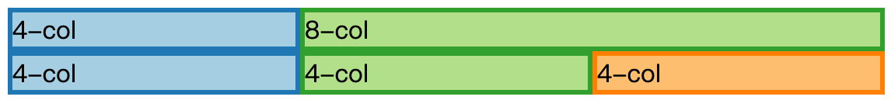

本章，我们会介绍不同的 CSS 布局属性是怎么影响大小，位置以及页面的所有布局。同时会提供一些谜题的讨论帮助你复习在之前几章学习到的内容。

本章是按照使用案例而不是属性或者特性来组织。首先，我们讨论大小和位置，然后会聚焦在两个特殊属性的使用上：grid-base 的布局，垂直和水平居中。

### CSS layout tricks and techniques used for sizing

与大小相关的技术允许您定义特定元素的大小，随着视口大小的变化，它应该如何增长以及它应该如何缩小。

- Height transfer
- Forced min-height
- Combining flex and non-flex items
- Sizing with constraints

`Height transfer`和基本的 HTML 文档不同，网络应用经常希望能占据视口的所有可用的空间以避免滚动条的出现。然而，典型的 HTML 元素包含几个有着默认属性`display:block`的根元素。如果这些盒没有特定的高度，它们将使用整个容器的高度而不是视口的高度。下面的代码强制`html`和`body`标签设置为视口高度的`100%`，这可以让你在后续标记中使用百分比引用视口高度。

```html
html, body {
  height: 100%;
}
```

CSS 3 增加了`vh`和`vw`单位，它始终指向视口的宽度和高度，这使得将元素的大小和视口关联更简单了，你不需要让树中的每个父项都传输视口的高度。

`min-height:100%`在 CSS 2.1中将元素对齐在父盒子的底部是很难的，因为盒子不是水平的从左至右的叠在一起，就是竖直的从上到下的叠在一起。设置`min-height`可以保证 div 是正常定位在和页面底部平齐的位置。

`结合 flex-grow:0 和 flex-grow:1`，flexbox 提供了强力的工具来控制元素的大小。Philip Walton's [Solved by Flexbox](http://philipwalton.github.io/solved-by-flexbox/)覆盖了几个额外的布局，但是这里我要指出一个特殊的技巧，使用`flex-grow:0`和`flex-grow:1`生成一个底部或顶部对齐的盒子，就像一个 header 或者 footer。原因非常简单：将主要内容放置在`flex-grow:1` flex 项中，并将 header 或 footer 放在`flex-grow:0`的 flex 项中。假设 flex 父级的大小为其父级的百分比，主内容的容器将占用剩余的所有空间，将页脚推到底部或将标题保留在顶部。

`Sizing with constraints`你可以利用通过基于约束的大小填充算法填充缺失值，适用于`position: absolute`的元素以及`display:block`的元素，但是后者只适用在宽度上。

如果你对绝对定位的元素设置了`width`或者`height`为`auto`，但是设置了`margin`的具体值，这样绝对定位的盒子的大小会自动调整以占据所有除了`margin`留下以外的可用空间。

### CSS layout tricks and techniques used for positioning

定位是布局的核心：或许最重要的任务是将元素放置在所有屏幕尺寸的正确相对位置。本节中的技术允许您完成此操作。

- Relative + absolute positioning
- Negative margins
- Transforms
- `margin:auto`
- Positioning with constraints

`Relative + absolute positioning`：`position:absolute`功能强大，因为你可以通过设置相对父元素的上下左右四个方向的偏移量来对齐元素。但是，在大多数情况下，您实际上并不想相对于视口定位div，您希望它相对于特定父级定位。

`Negative margins`：margins 在 CSS 里是可以设置为负数的；一般来说这个特性不是特别有用，因为当元素大小不固定时很难正确地使用这个特性。但是，它可能对一些本来很难的事情很有用。例如，如果你想让一个元素溢出 —例如图像轮播导航按钮— 设置一个固定的负边距可以故意造成溢出。另一个突出用例是主要用在旧版本的 IE 上，你讲在后面看到。

`Transforms`：CSS 3 引入了`transform:translate()`方法，它允许元素的定位根据它自己的长宽决定。这是一个使用负边距的可行替代方案。学习它是很值得的，具体而言，它允许将值表现为当前框的百分比，而不是之前 CSS 中的父盒子的百分比。例如`transforms:translateX(-50%)`将会向左移动当前盒子宽度50%的距离，对于没有固定的预定宽度的盒子，使用负边距也是不能做到的。

`margin:auto`：设置`margin:auto`在两种情况下很有用，因为这样可以使用内置算法实现居中。

- 设置`margin-left:auto`和`margin-right:auto`在块级盒子上可以让他们水平居中，还需要设置`width`来保证这个效果。
- 设置`margin:auto`和`position:absolute`可以让盒子水平和垂直居中，还需要设置`width`和`height`的值以及所有的偏移量(`top`,`left`,`bottom`,`right`)为`0`来保证这个效果。

`Positioning with constraints`：对于设置了`width`和`display:block`属性的盒子，你可以通过`position:absolute`属性做很多有趣的事情。对于绝对定位的元素，可以触发基于限制的大小计算。

例如，你想让一个盒子定位在一个父盒子的左边或右边，同时保持垂直居中，就像轮播图的左右导航按钮那样。为了达到这个效果，先将父盒子设置为`position:relative`，然后使用下面的样式：

```css
.parent {
  position: relative;
  width: 80%;
  height: 80%;
  margin: 0 40px;
}
.previous, .next {
  position: absolute;
  width: 30px;
  height: 20px;
  top: 0;
  bottom: 0;
  margin: auto;
}
.previous {
  left: 0;
  margin-left: -15px;
}
.next {
  right: 0;
  margin-right: -15px;
}
```

```html
<div class="parent blue">
  <div class="previous green">prev</div>
  <div class="next red">next</div>
</div>
```

在垂直方向上，`top:0`，`bottom:0`，`margin-top:auto`，`margin-bottom:auto`的结合触发了居中。在水平方向上，对于`.parent`div，`left:0`，`right:0`，`margin-right:auto`，`margin-left:-15px(或者 auto)`可以让盒子定位在父盒子的左边缘。`-15px`的负边距(宽度的一半)将盒子整齐的放在盒子的顶部，`.next`div同理。

### Float-based grids: how CSS grid framework work

Grid 布局框架是现代布局的多功能工具。它们允许你讲任何内容区域拆分为一组列，同时允许布局适应移动视口大小。

相对于使用 float 将元素定位在某一列的左边或者右边，Grid 框架使用适当大小的多个 float 将空间细分为列。

这些列有许多良好的属性：

- 它们能按照预期地工作，用于左右对齐的内容，即列彼此对齐，右对齐列与右侧对齐
- 使用一列固定的百分比宽度，任何可用空间都可以分为子列

像 Bootstrap 这样的 Grid 框架通常使用一些关键属性和技术。首先，设置`box-sizing:border-box`使得计算`padding`更加简单。

下一步， Gird 框架使用四种技术来实现它们的行为：

`Floats`，列本身只是简单的有着属性`float:left`的 divs，这样可用于将盒子放置在其容器盒的左右边缘。对于Grid 框架，因为 floats 始终堆叠在左侧，就可以设置为必须占用父宽度的特定百分比。

`Percentage-base width`，grid 列的`width`值被定义为它父元素的百分比。框架保证这些宽度加起来是`100%`，考虑到四舍五入可能出现的问题。这意味着列将始终适合框架中的单个行，并占据总宽度的一些除数。

例如，在12列布局中，1列的 float将分配给他的可用宽度(百分比)的 1/12，放置一个4列的 float 和 8列的 float 将允许 33%:66% 的可用空间分割。

`Relative positioning`，Grid 框架的列一般默认设置`position:relative`，这可以使他们充当任何绝对定位内容的参考点。

`Grid row clearing`，为了包含和清除浮动，网格行要么建立新的格式化上下文或者使用 clearfix。

`Clearfix`，多年来，clearfix 有几个不同的版本，现代版本不那么糟糕，因为他们包含较少旧的 IE 特定修复程序。

clearfix 将几个理想的属性组合到一个类中：

- 它可以防止已经清除浮动的父元素中浮动影响已清除浮动元素后面其他元素中的 line box
- 它会在计算元素的高度时考虑已清除浮动的父元素的 floats

`Creating formatting contexts`，创建新的格式化上下文是一个很有用的方法，它可以控制 floats 和页面的剩余部分交互。

新的格式化上下文：

- contains floats：floats 仅与同一格式化上下文中的元素交互
- Interacts with floats as a unit：建立格式化上下文的框放置在浮动框旁边，或者不合适，则在其下方清除；格式化上下文之外的 floats 不会影响建立新格式化上下文的框的内容
- 防止边距在建立格式化上下文的框与其父级之间折叠

让我们创建自己的基本 Grid 框架来演示这些技术如何协同工作。以下实例说明：

```css
* { box-sizing: border-box; }
.row:after {
  content: "";
  display: table;
  clear: both;
}
.column-4, .column-8 {
  float: left;
  position: relative;
}
.column-4 {
  width: 33.3333%;
}
.column-8 {
  width: 66.6667%;
}
```

```html
<div class="row">
  <div class="column-4 blue">4-col</div>
  <div class="column-8 green">8-col</div>
</div>
<div class="row">
  <div class="column-4 blue">4-col</div>
  <div class="column-4 green">4-col</div>
  <div class="column-4 orange">4-col</div>
</div>
```



为了使其适应不同的大小，行可以具有定义的转换点，其中它们使用媒体查询切换到不同的大小。对于屏幕较小的屏幕尺寸，您将需要将列更改为更基本的`display:block`和`float:none`布局。

### Techniques for horizontal and vertical centering in CSS

水平和垂直居中在 CSS 中是很复杂的，有很多基于不同需求和权衡的技术，可以看一看shshaw的 [codepen resource on centering](http://codepen.io/shshaw/full/gEiDt)作为额外的例子，当然他对于这些技术为什么可以工作的解释过于复杂，因为`position:absolute`的盒子是简单的应用了 [sized in one step using the constraint-based algorithm](http://book.mixu.net/css/2-box-model.html#absolutely-positioned-non-replaced-elements)，没有5个步骤这么多。

在本节中，我将演示水平和垂直居中的技术，并要求您思考它们的工作原理以及它们的优点和缺点。

首先，我将介绍三种技术，这些技术允许您将项目至于水平轴或者垂直轴上，但不能同时使用两者。

`Horizontally centering block-level elements in normal flow`，你可以触发水平居中在块级盒子元素中：

```css
.block-center {
  display: block;
  width: 30px;
  margin-left: auto;
  margin-right: auto;
}
```

```html
<div class="blue">
  <div class="block-center green">Centered</div>
</div>
```


这个技术的缺点在于需要明确指定块的宽度才能进行居中。例如，在上面的例子中，文本溢出了一点，因为我没有得到完全正确的宽度。

`Horizontally centering inline-level elements within line boxes`，`text-align`属性允许内联元素水平居中。

```css
.text-align-center {
  text-align: center;
}
```

```html
<div class="text-align-center blue">
  <span class="green">Centered</span>
</div>
```

这个方法的问题在于长行文本将在内联格式化上下文中包装到多个线框中，而且只有在线框被分解后才会应用居中，对于文本来说这是正确的行为，但如果您将非文本项目居中，则当包含元素非常小并且项目被分解到多个线框时，您可能会看到不期望的行为。

`Vertically centering inline-block elements`，`vertical-align`属性应用在内联块元素上可以让它在内联格式化上下文中垂直居中。

```css
.valign-center {
  vertical-align: middle;
  height: 100px;
}
```

```html
<div class="valign-center blue">
  <span class="green">Centered</span>
</div>
```


这里设置了`vertical-align:middle`没有导致单个内联元素垂直居中，原因是内联级内容首先被分割到 line box 上，它们的位置只是从容器的顶部开始，建立了格式化上下文。`vertical-align:middle`只影响同一 line box 中的内联块级的相对对齐，line box 的高度由它的内容决定，由于只有一个项目，line box 的高度和项目的高度完全匹配，最终结果是 line box 位于父容器顶部。

由两种方法可以解决上面的问题

1. 指定`line-height`的值
2. 使用一个 inline-block 的伪元素强制当前 line box 的高度为父元素高度的100%

对于方法1，不能设置`line-height`为100%，因为 line-height 是相对于父元素的 font height，而不是父元素的container height

对于方法2，需要使用 inline-block 因为正常的内联级盒子没有`height`属性所以不能参照父元素的高度。

